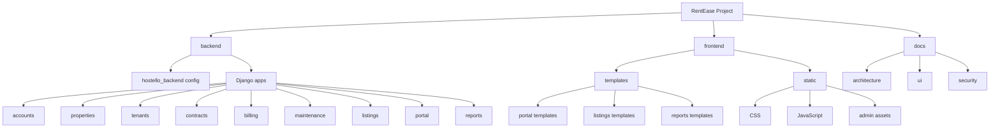

# RentEase - Web Quản Lý Nhà Trọ Bằng Django

RentEase là hệ thống quản lý nhà trọ/phòng trọ được phát triển bằng Django. Dự án được kế thừa từ mã nguồn HOSTELLO cũ và đã được mở rộng thành ứng dụng có phân quyền theo vai trò: khách truy cập, chủ trọ, khách thuê và quản trị viên.

RentEase hiện phù hợp cho demo cục bộ, kiểm thử luồng nghiệp vụ và tiếp tục phát triển thành sản phẩm thực tế. Dự án chưa được đánh dấu production-ready.

## Kien Truc Du An

RentEase hien dung cau truc monorepo ro rang hon, lay cam hung tu cach to chuc cua FoodieGo:

```text
RentEase/
|-- backend/                 # Django backend
|   |-- hostello_backend/    # Django config package: settings.py, urls.py, wsgi.py, asgi.py
|   |-- accounts/
|   |-- properties/
|   |-- tenants/
|   |-- contracts/
|   |-- billing/
|   |-- maintenance/
|   |-- listings/
|   |-- portal/
|   |-- reports/
|   |-- manage.py
|   `-- requirements.txt
|
|-- frontend/                # Django Template frontend
|   |-- templates/
|   |   |-- portal/
|   |   |-- listings/
|   |   |-- reports/
|   |   |-- admin/
|   |   `-- ...
|   `-- static/
|       |-- css/
|       |-- js/
|       `-- admin/
|
|-- docs/
|-- README.md
`-- run_backend.bat
```

Ghi chu quan trong:

- RentEase di theo phong cach monorepo giong FoodieGo: tach ro `backend/`, `frontend/`, va `docs/`.
- Khac FoodieGo, RentEase khong dung React/Vite.
- `frontend/` trong RentEase co nghia la Django Templates + static CSS/JS, khong phai frontend SPA rieng.
- `backend/hostello_backend/` van la Django config package va chua nen doi ten thanh `config`.
- `DJANGO_SETTINGS_MODULE` van la `hostello_backend.settings`.
- Cac Django apps van nam truc tiep trong `backend/`; chua di chuyen vao `backend/apps/`.

So do tong quan:



`backend/` la noi chua Django project logic, apps, settings, urls, forms, views, models va admin.

`frontend/` la noi chua Django Templates, CSS, JavaScript va UI assets. Du an van dung Django Templates, khong dung React.

Xem ban do chi tiet tai:

```text
docs/architecture/PROJECT_STRUCTURE_MAP.md
```

## Yêu Cầu Hệ Thống

- Windows hoặc môi trường có thể chạy Python/Django
- Python 3.12 trong virtual environment hiện có
- SQLite cho môi trường local demo
- Trình duyệt để kiểm thử giao diện

## Hướng Dẫn Chạy Nhanh

Từ thư mục gốc repository:

```powershell
cd backend
```

Virtual environment chinh thuc cua du an nam tai `backend/venv/`. Sau khi da `cd backend`, hay dung `.\venv\Scripts\python.exe`. Khong dung root-level `venv/` sau khi du an da tach `backend/` va `frontend/`.

Cài thư viện nếu cần:

```powershell
.\venv\Scripts\python.exe -m pip install -r requirements.txt
```

Kiểm tra Django:

```powershell
.\venv\Scripts\python.exe manage.py check
.\venv\Scripts\python.exe manage.py makemigrations --check --dry-run
```

Chạy server local:

```powershell
.\venv\Scripts\python.exe manage.py runserver
```

Mở trình duyệt:

```text
http://127.0.0.1:8000/
```

## Vai Trò Người Dùng

| Vai trò | Chức năng chính |
| --- | --- |
| Visitor | Xem phòng đang đăng, xem chi tiết phòng, gửi yêu cầu xem phòng |
| Owner | Quản lý phòng, tin đăng, khách thuê, hợp đồng, hóa đơn, thanh toán, sửa chữa, lịch xem phòng |
| Tenant | Xem hồ sơ, hợp đồng, hóa đơn, lịch sử thanh toán, yêu cầu sửa chữa và thông báo |
| Admin/Staff | Quản trị dữ liệu qua Django Admin/Jazzmin và xem báo cáo staff-only |

## Tính Năng Chính

### Public

- Trang giới thiệu RentEase
- Danh sách phòng đang đăng
- Chi tiết phòng
- Form đăng ký xem phòng

### Owner

- Dashboard chủ trọ
- Quản lý phòng
- Quản lý tin đăng
- Xem và cập nhật khách thuê đã liên kết
- Tạo/cập nhật hợp đồng
- Tạo/cập nhật hóa đơn
- Ghi nhận thanh toán
- Xử lý yêu cầu sửa chữa
- Xử lý đăng ký xem phòng

### Tenant

- Dashboard khách thuê
- Hồ sơ cá nhân
- Hợp đồng đang liên quan
- Hóa đơn và trạng thái thanh toán
- Lịch sử thanh toán
- Yêu cầu sửa chữa
- Thông báo

### Admin Và Reports

- Django Admin/Jazzmin đã đổi nhận diện RentEase
- Báo cáo staff-only
- Báo cáo hóa đơn, phòng, khách thuê/hợp đồng, bảo trì và tin đăng
- Admin search privacy hardening: không dùng `citizen_id` trong các bề mặt search/list chính

## Công Nghệ Sử Dụng

- Python
- Django
- Django Templates
- Django Admin
- Jazzmin
- Django REST Framework trong phần legacy/API cũ còn tồn tại
- SQLite cho local demo
- HTML/CSS/JavaScript tĩnh

Không sử dụng React trong phiên bản hiện tại.

## Màn Hình Chính

| Khu vực | URL |
| --- | --- |
| Trang chủ | `/` |
| Danh sách phòng | `/rooms/` |
| Đăng nhập | `/login/` |
| Owner dashboard | `/owner/dashboard/` |
| Tenant dashboard | `/tenant/dashboard/` |
| Admin | `/admin/` |
| Reports | `/reports/` |
| Legacy HOSTELLO | `/legacy/` |

## Quy Tắc Bảo Mật Và Dữ Liệu

- Không hiển thị `citizen_id`, CCCD/CMND hoặc ảnh giấy tờ ở list view thông thường.
- Không hiển thị mật khẩu, quyền hệ thống hoặc thông tin xác thực nội bộ.
- Owner chỉ được xem dữ liệu thuộc phòng của mình.
- Tenant chỉ được xem dữ liệu của chính mình.
- Public user không được xem hợp đồng, hóa đơn, thanh toán, bảo trì nội bộ hoặc dữ liệu riêng.
- Không commit `db.sqlite3`, file backup JSON, `.env`, media upload thật hoặc dữ liệu cá nhân thật.
- Legacy HOSTELLO không được đưa lại ra root route nếu không có kiểm duyệt riêng.

## Tính Năng Đã Hoàn Thành Quan Trọng

- Owner Room Create/Update
- Owner Tenant Update
- Owner Contract Create/Update
- Owner Invoice Create/Update
- Owner Payment Recording
- Tenant Invoice/Payment Visibility
- Tenant Repair Request Submission
- Owner Repair Processing
- Owner Viewing Registration Processing
- Reports Dashboard
- Public Room Listing UI
- Demo data seed command
- Admin Search Privacy Hardening
- UI polish nhiều vòng cho public, owner, tenant, reports và admin

## Demo Data Local

Tạo dữ liệu demo an toàn:

```powershell
.\venv\Scripts\python.exe manage.py seed_rentease_demo_data --owner-username owner_test --tenant-username tenant_test
```

Lệnh này dùng dữ liệu giả, có tiền tố demo và được thiết kế để chạy lặp lại an toàn trong môi trường local. Không commit database sau khi seed.

Tài khoản local demo thường dùng:

| Vai trò | Username | Password |
| --- | --- | --- |
| Admin | `admin_test` | `Test@12345` |
| Owner | `owner_test` | `Test@12345` |
| Tenant | `tenant_test` | `Test@12345` |

## Hướng Dẫn Phát Triển

Trước khi sửa code:

```powershell
git branch --show-current
git status --short
cd backend
.\venv\Scripts\python.exe manage.py check
.\venv\Scripts\python.exe manage.py makemigrations --check --dry-run
```

Quy tắc quan trọng:

- Không đổi schema nếu chưa được duyệt.
- Không tạo migration nếu chưa được duyệt.
- Không đổi model khi chỉ làm UI/tài liệu.
- Không di chuyển app/template/static hàng loạt trong một bước.
- Không đổi quyền truy cập hoặc owner-scoped queryset nếu không có phase bảo mật riêng.
- Nếu đổi đường dẫn template, phải cập nhật `render()` tương ứng và kiểm tra route.
- Nếu đổi đường dẫn static, phải cập nhật `` và cấu hình liên quan một cách an toàn.

## Cải Tiến Tương Lai

- Tách production settings khỏi local settings.
- Tổ chức lại templates thành nhóm public/owner/tenant/reports rõ hơn.
- Tổ chức lại static thành nhóm CSS/JS/images cho RentEase và vendor.
- Hoàn thiện billing detail, utility/service charges và quy trình công nợ.
- Hoàn thiện onboarding tài khoản owner/tenant.
- Chuẩn bị deployment, static/media, email, logging và production database.
- Kiểm thử tự động và CI.

## Thành Viên Nhóm

- HoangNam2464
- Thành viên 2: cập nhật theo nhóm đồ án

## Phiên Bản Và Ngày Cập Nhật

- Nhánh chính hiện tại: `complete-product`
- Trạng thái: local-demo ready, chưa production-ready
- Tag demo mới nhất: `release-rentease-polished-local-demo-v2`
- Tag hardening mới nhất: `phase20n-admin-search-privacy-hardening`
- Ngày cập nhật: 26/06/2026
