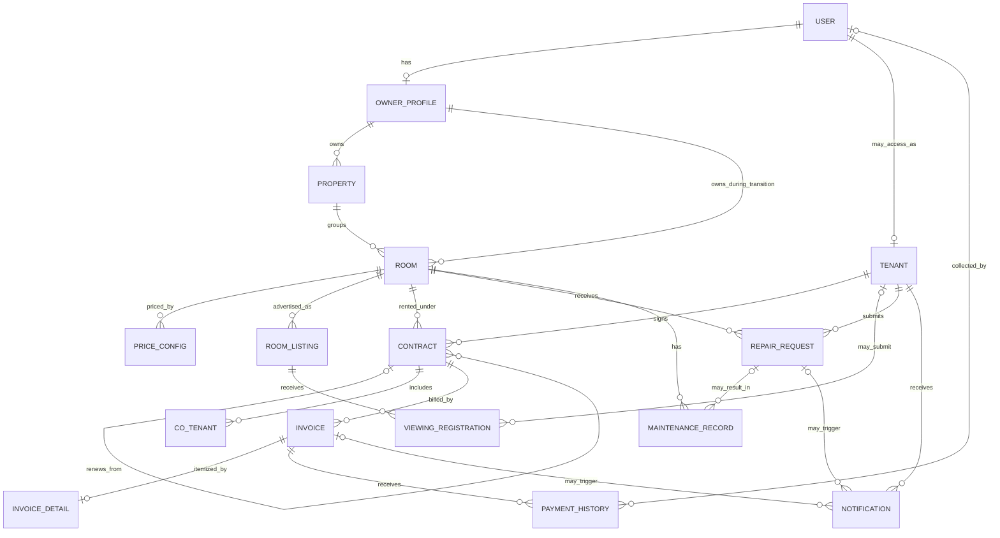

# RentEase Data Model Alignment

This is the current comparison between the active Django model graph and the supplied `rentease.drawio` ERD. It is an architecture reference for PostgreSQL planning, not permission to change models or generate migrations.

The approved target direction and staged implementation plan live in `docs/architecture/TARGET_DATA_MODEL.md`.

## Verdict

The ERD is a useful conceptual map and covers the main rental workflow, but it is not an exact representation of the current Django schema. PostgreSQL must be created from reviewed Django migrations, not by translating the diagram directly into SQL.

The diagram contains 15 conceptual entities. All 15 have an active Django equivalent, but several relationships and field groups differ from the implementation.

## Entity Alignment

| Diagram entity | Active Django model/table | Alignment |
|---|---|---|
| `TAI_KHOAN` | `accounts.User` / `accounts_user` | Close. Django auth also owns staff, superuser, active-state, login, name, and permission fields. |
| `NGUOI_DUNG` | `accounts.UserProfile` / `nguoi_dung` | Close. This is the owner/manager profile, not a second authentication table. |
| `KHACH_THUE` | `tenants.Tenant` / `khach_thue` | Close. The account link is optional; status and timestamps also exist. |
| `PHONG` | `properties.Room` / `phong` | Close. Description and timestamps also exist; Property membership is required while the direct owner link remains transitional. |
| `NGUOI_O_CUNG` | `tenants.CoTenant` / `nguoi_o_cung` | Direct match. |
| `HOP_DONG` | `contracts.Contract` / `hop_dong` | Close. The previous-contract relationship is a self-reference. |
| `CAU_HINH_GIA` | `billing.PriceConfig` / `cau_hinh_gia` | Partial. Current code links price configuration to a room; owner is derived through `room.owner`. |
| `HOA_DON` | `billing.Invoice` / `hoa_don` | Close. Current code also has an invoice code and timestamps. |
| `CHI_TIET_HOA_DON` | `billing.InvoiceDetail` / `chi_tiet_hoa_don` | Close, but the current relationship to invoice is one-to-one. |
| `LICH_SU_THANH_TOAN` | `billing.PaymentHistory` / `lich_su_thanh_toan` | Close. Collector links to the Django user table. |
| `YEU_CAU_SUA_CHUA` | `maintenance.RepairRequest` / `yeu_cau_sua_chua` | Partial. Request intake is separate from vendor, cost, and performed-work records. |
| `TIN_PHONG` | `listings.RoomListing` / `tin_phong` | Close. Current code also stores deposit, availability, expiry, and timestamps. |
| `DANG_KY_XEM_PHONG` | `listings.ViewingRegistration` / `dang_ky_xem_phong` | Partial. Current code links to a listing, not directly to a room, and may link to a tenant. |
| `THONG_BAO` | `maintenance.Notification` / `thong_bao` | Partial. Current code can link to an invoice or repair request and tracks read state. |
| `BAO_TRI` | `maintenance.MaintenanceRecord` / `bao_tri` | Partial. Current code records performed maintenance and can link it to a repair request; it does not yet model a full maintenance schedule. |

`accounts.WardenProfile` also exists for retained HOSTELLO compatibility and is intentionally outside the RentEase ERD.

`properties.Property` / `co_so_cho_thue` is an approved RentEase extension above rooms. It is not one of the original 15 diagram entities. Phase 14C-3A4 requires Property membership and Property-scoped room codes while `Room.owner` remains authoritative for access control.

`billing.ServiceDefinition`, `billing.Meter`, `billing.MeterReading`, and `billing.InvoiceLine` are additive target-model foundations introduced in Phase 14C-3B2. They do not yet replace `PriceConfig`, `InvoiceDetail`, or any current invoice calculation/read/write path.

## Relationship Corrections

Use these relationships as current truth:

1. `User` has optional one-to-one owner `UserProfile` and optional one-to-one `Tenant` profile.
2. `Property` belongs to `UserProfile`. `Room.property` is required; `Room.owner` remains the authoritative owner-scoping relationship during the authorization transition.
3. `PriceConfig` belongs to `Room`. Do not add a duplicate direct owner foreign key without a separate design decision.
4. `Contract` joins `Room` and `Tenant`, and may reference a previous `Contract`.
5. `Invoice` belongs to `Contract`; `InvoiceDetail` is one-to-one with `Invoice`; `PaymentHistory` is many-to-one with `Invoice`.
6. `ViewingRegistration` belongs to `RoomListing`, not directly to `Room`, and its tenant link is optional.
7. `Notification` belongs to `Tenant` and may reference an `Invoice` or `RepairRequest`.
8. `MaintenanceRecord` belongs to `Room` and may reference the originating `RepairRequest`.

## Capabilities Not Yet Fully Modeled

The diagram and current schema both omit or only partially represent several production capabilities:

- eventually deriving room ownership through Property after a separately reviewed authorization migration
- room image galleries, amenities, and listing location/search metadata
- backfilled invoice lines, authoritative meter-reading workflows, and owner utility-entry UI
- owner and tenant onboarding, invitations, recovery, and account verification
- planned maintenance schedules, vendors, work orders, and before/after attachments
- payment reconciliation, gateway callbacks, receipts, refunds, and deposit settlement
- notification delivery channels, templates, retries, and delivery history
- audit logs, import provenance, retention, consent, and protected media access

These are future product decisions. Their placeholders live under `docs/features/planned/`; they are not active apps or approved schema.

## PostgreSQL Boundary

For a fresh PostgreSQL database:

- use Django migrations as the schema source of truth
- do not copy demo, regression, or test records from local SQLite
- do not invent people, contracts, payments, citizen IDs, or operational history
- create the first administrator through an approved bootstrap procedure
- load real records only from owner-approved sources through a validated import or admin workflow
- validate foreign keys, uniqueness, row counts, money totals, and owner/tenant isolation before cutover
- keep SQLite available only as an explicit local-development fallback until PostgreSQL verification is complete

Changing settings, models, migrations, or data remains a separate approval-gated phase.
