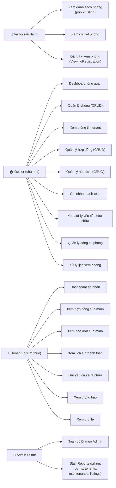
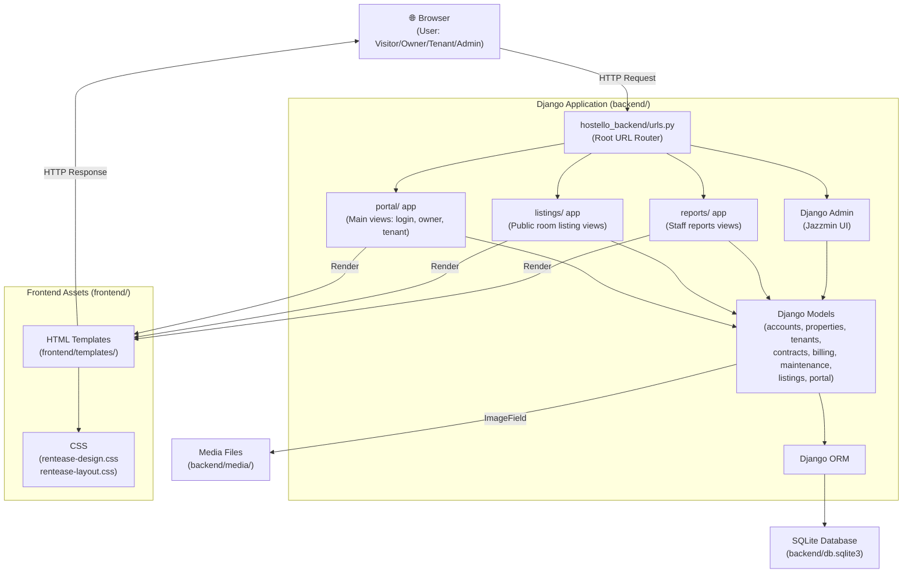
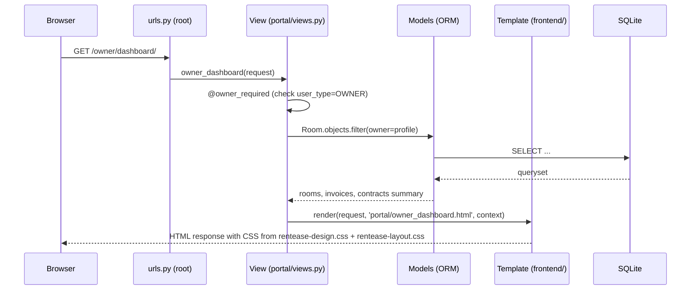
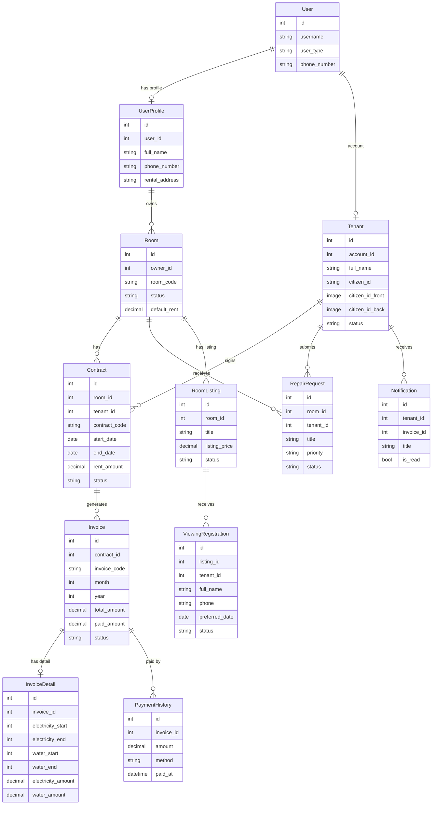
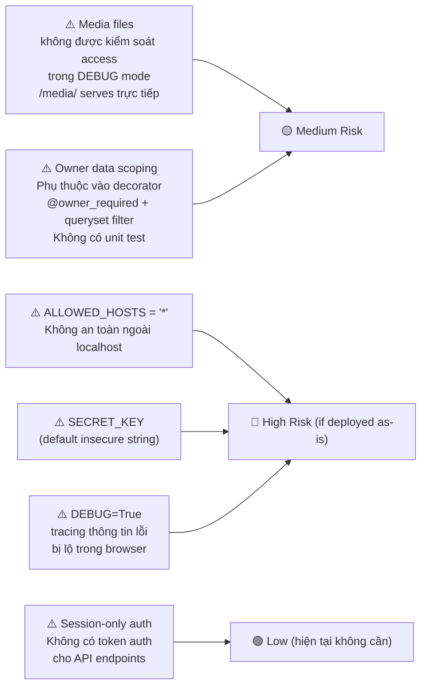
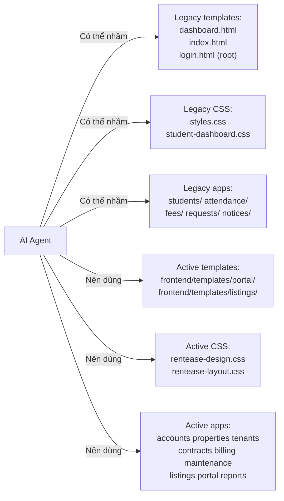
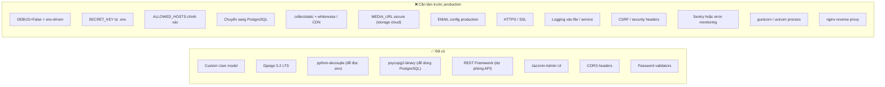
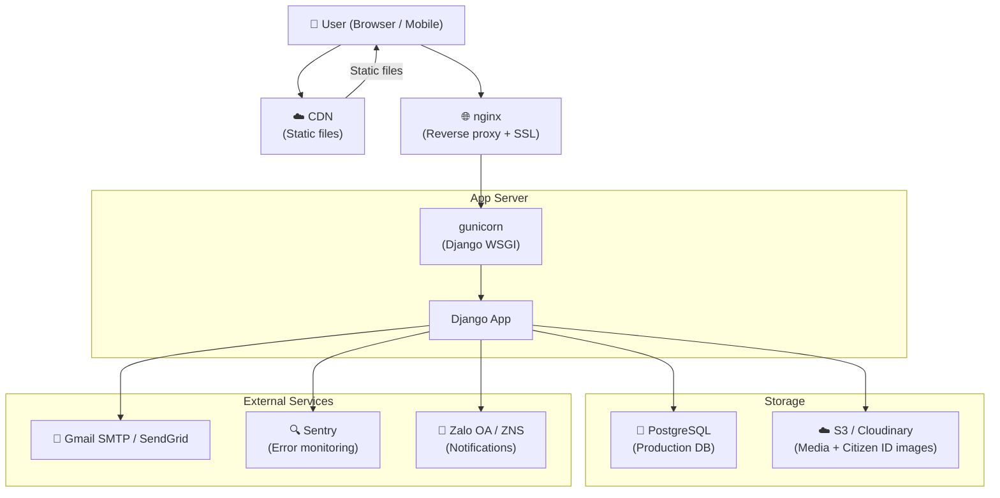

# RentEase — Full Project Technical Analysis

**Ngày phân tích:** 2026-06-27
**Branch:** `complete-product`
**Người thực hiện phân tích:** AI Agent (Antigravity)
**Commit mới nhất:** `7228f0b Add Antigravity rules for RentEase agents`
**Phiên bản Django:** 5.2.6

> Tài liệu này được viết song ngữ (Việt–English) để phục vụ cả reviewer kỹ thuật lẫn người đọc tổng quan không phải developer.

---

## 1. Tổng quan dự án (Project Overview)

### 1.1 RentEase là gì?

RentEase là một hệ thống quản lý nhà trọ / phòng cho thuê dựa trên Django. Hệ thống được phát triển từ dự án gốc có tên **HOSTELLO** — ban đầu là một hệ thống quản lý ký túc xá học sinh theo mô hình Ấn Độ. RentEase đã được tái cấu trúc và xây dựng lại để phục vụ mô hình cho thuê phòng tại Việt Nam.

**Mục đích chính:**
- Cho phép chủ nhà (owner) quản lý phòng, hợp đồng, hóa đơn, và yêu cầu sửa chữa.
- Cho phép người thuê (tenant) xem hợp đồng, hóa đơn, và gửi yêu cầu bảo trì.
- Cung cấp admin panel cho staff quản lý toàn bộ hệ thống.
- Cung cấp trang đăng tin và đăng ký xem phòng công khai cho khách vãng lai (visitor).

### 1.2 Mức độ trưởng thành hiện tại

| Tiêu chí | Trạng thái |
|---|---|
| Cơ sở dữ liệu schema | ✅ Đã thiết kế và ổn định |
| Admin panel | ✅ Hoạt động, có Jazzmin UI |
| Owner portal | ✅ Đầy đủ CRUD cơ bản |
| Tenant portal | ✅ Đọc dữ liệu, gửi yêu cầu |
| Public listing | ✅ Đăng tin, xem phòng |
| Demo data seed | ✅ Lệnh `seed_rentease_demo_data` |
| Automated tests | ❌ Không có test suite |
| Production settings | ❌ Chưa cứng hoá |
| PostgreSQL | ❌ Đang dùng SQLite |
| Deployment config | ❌ Chưa có |
| Email production | ❌ Chỉ cấu hình Gmail SMTP cơ bản |

### 1.3 Demo vs. Production

- **Local demo ready**: Hệ thống có thể chạy ở máy local cho mục đích demo với `python manage.py runserver`.
- **Not production-ready**: `DEBUG=True`, `SECRET_KEY` mặc định không an toàn, SQLite, không có whitenoise/collectstatic workflow, không có logging đầy đủ.

---

## 2. Cấu trúc dự án (Project Structure)

### 2.1 Sơ đồ cấu trúc thư mục

```mermaid
graph TD
    ROOT["RentEase/ (repository root)"]
    ROOT --> AGENTS["AGENTS.md (agent rules)"]
    ROOT --> README["README.md"]
    ROOT --> BACKEND["backend/ (Django backend)"]
    ROOT --> FRONTEND["frontend/ (templates + static)"]
    ROOT --> DOCS["docs/ (documentation)"]
    ROOT --> AGENTS_DIR[".agents/ (AI agent config)"]

    BACKEND --> MANAGE["manage.py"]
    BACKEND --> HOSTELLO_PKG["hostello_backend/ (Django config)"]
    BACKEND --> VENV["venv/ (local Python env)"]
    BACKEND --> DB["db.sqlite3 (local DB, git-ignored)"]
    BACKEND --> ACTIVE_APPS["Active RentEase Apps"]
    BACKEND --> LEGACY_APPS["Legacy HOSTELLO Apps"]

    HOSTELLO_PKG --> SETTINGS["settings.py"]
    HOSTELLO_PKG --> URLS["urls.py (root URL config)"]
    HOSTELLO_PKG --> WSGI["wsgi.py + asgi.py"]

    ACTIVE_APPS --> accounts
    ACTIVE_APPS --> properties
    ACTIVE_APPS --> tenants
    ACTIVE_APPS --> contracts
    ACTIVE_APPS --> billing
    ACTIVE_APPS --> maintenance
    ACTIVE_APPS --> listings
    ACTIVE_APPS --> portal
    ACTIVE_APPS --> reports

    LEGACY_APPS --> students
    LEGACY_APPS --> attendance
    LEGACY_APPS --> fees
    LEGACY_APPS --> requests_app["requests"]
    LEGACY_APPS --> notices

    FRONTEND --> TEMPLATES["templates/ (HTML templates)"]
    FRONTEND --> STATIC["static/ (CSS, JS, images)"]

    DOCS --> AGENT_DOCS["agent/ (agent context files)"]
    DOCS --> ARCHITECTURE["architecture/"]
    DOCS --> DEMO["demo/"]
    DOCS --> SECURITY["security/"]
    DOCS --> SPQM["spqm/"]
    DOCS --> UI["ui/"]
    DOCS --> ARCHIVE["archive/"]
```

### 2.2 Cấu trúc quan trọng

| Đường dẫn | Vai trò |
|---|---|
| `backend/manage.py` | Lệnh quản lý Django |
| `backend/hostello_backend/settings.py` | Toàn bộ cấu hình Django |
| `backend/hostello_backend/urls.py` | URL root config |
| `backend/venv/` | Virtual environment (chỉ dùng `backend/venv`) |
| `frontend/templates/` | Tất cả HTML templates |
| `frontend/static/css/` | CSS files |
| `docs/agent/` | Tài liệu cho AI agents |
| `.agents/rules/` | Luật an toàn cho Antigravity agents |

---

## 3. User Roles và Tính năng (User Roles and Features)

### 3.1 Sơ đồ phân quyền

### 3.2 Chi tiết từng role

**Visitor (Khách vãng lai)**
- Không cần đăng nhập.
- Xem danh sách phòng đang đăng tin (RoomListing status=published).
- Xem chi tiết từng phòng.
- Đăng ký lịch xem phòng (ViewingRegistration) bằng tên + số điện thoại.

**Owner (Chủ nhà)**
- Đăng nhập với `user_type=OWNER`.
- Phải có `UserProfile` (bảng `nguoi_dung`) được liên kết.
- Quản lý phòng, hợp đồng, hóa đơn, thanh toán của phòng thuộc `owner` field.
- Xem và xử lý yêu cầu sửa chữa.
- Quản lý đăng tin và lịch xem phòng.
- **Dữ liệu bị scope theo owner**: views chỉ trả về dữ liệu của owner đang đăng nhập (Room.objects.filter(owner=owner_profile)).

**Tenant (Người thuê)**
- Đăng nhập với `user_type=TENANT`.
- Phải có `Tenant` record được liên kết qua `account` field.
- Chỉ xem dữ liệu của bản thân (hợp đồng, hóa đơn, thanh toán).
- Gửi yêu cầu sửa chữa.
- Xem thông báo hệ thống.

**Admin / Staff**
- Django admin panel với Jazzmin UI.
- Quản lý tất cả models.
- Reports dashboard: billing, rooms, tenants, contracts, maintenance, listings.
- Legacy HOSTELLO apps bị ẩn trong Jazzmin nhưng vẫn accessible qua URL trực tiếp.

---

## 4. Kiến trúc kỹ thuật (Technical Architecture)

### 4.1 High-Level System Architecture

### 4.2 Trách nhiệm từng Django app

| App | Bảng DB chính | Vai trò |
|---|---|---|
| `accounts` | `nguoi_dung`, `accounts_user` | Custom User model (OWNER/TENANT/ADMIN), UserProfile (chủ nhà), WardenProfile (legacy) |
| `properties` | `phong` | Quản lý phòng (Room), thuộc về owner profile |
| `tenants` | `khach_thue`, `nguoi_o_cung` | Tenant profile, CoTenant |
| `contracts` | `hop_dong` | Hợp đồng thuê phòng, liên kết Room + Tenant |
| `billing` | `cau_hinh_gia`, `hoa_don`, `chi_tiet_hoa_don`, `lich_su_thanh_toan` | PriceConfig, Invoice, InvoiceDetail (điện/nước), PaymentHistory |
| `maintenance` | `yeu_cau_sua_chua`, `bao_tri`, `thong_bao` | RepairRequest, MaintenanceRecord, Notification |
| `listings` | `tin_phong`, `dang_ky_xem_phong` | RoomListing (đăng tin công khai), ViewingRegistration |
| `portal` | — | Views tổng hợp cho owner/tenant, authentication, decorators, forms, seed command |
| `reports` | — | Views báo cáo dành cho staff (no own models, queries other apps) |

### 4.3 URL / View / Template Flow

### 4.4 Domain Data Relationship

### 4.5 Cấu hình Django đáng chú ý

| Cấu hình | Giá trị hiện tại | Ghi chú |
|---|---|---|
| `AUTH_USER_MODEL` | `accounts.User` | Custom user model — quan trọng, không được thay đổi sau khi deploy |
| `DEBUG` | `True` (default) | Đọc từ `.env` nếu có `python-decouple` |
| `SECRET_KEY` | Insecure default | Đọc từ `.env`, nhưng default là string không an toàn |
| `ALLOWED_HOSTS` | `['localhost', '127.0.0.1', '*']` | `'*'` không an toàn cho production |
| `DATABASE` | SQLite | `psycopg2-binary` đã có trong requirements, sẵn sàng chuyển PostgreSQL |
| `TIME_ZONE` | `Asia/Kolkata` | ⚠️ Vẫn là múi giờ Ấn Độ — nên đổi thành `Asia/Ho_Chi_Minh` |
| `LANGUAGE_CODE` | `en-us` | Chưa có i18n Tiếng Việt |
| `MEDIA_ROOT` | `backend/media/` | Lưu ảnh upload locally |
| `STATIC_ROOT` | `backend/staticfiles/` | Chưa có quy trình `collectstatic` cho production |
| `DEFAULT_FROM_EMAIL` | `HOSTELLO Warden` | ⚠️ Vẫn để tên HOSTELLO |
| Jazzmin `hide_apps` | `students, attendance, fees, requests, notices` | Legacy apps bị ẩn khỏi admin sidebar |
| `corsheaders` | Được cài, cho phép `localhost:3000`, `localhost:5500` | Dự phòng cho React/Vue frontend trong tương lai |
| `rest_framework` | Được cài, session authentication | Dự phòng API cho mobile/Zalo trong tương lai |

---

## 5. Phân tích bảo mật và quyền riêng tư (Security and Privacy Analysis)

### 5.1 Sensitive Tenant Fields

Ba trường nhạy cảm nhất trong hệ thống:

| Trường | Model | Loại | Rủi ro |
|---|---|---|---|
| `citizen_id` | `Tenant`, `CoTenant` | CharField (unique) | CCCD/CMND — nhận dạng danh tính |
| `citizen_id_front` | `Tenant` | ImageField | Ảnh mặt trước CCCD |
| `citizen_id_back` | `Tenant` | ImageField | Ảnh mặt sau CCCD |

### 5.2 Những gì đã được bảo vệ (Phase 20K-A + 20N)

- ✅ `TenantAdmin`: `citizen_id` đã bị xoá khỏi `list_display` và `search_fields`.
- ✅ `CoTenantAdmin`: tương tự.
- ✅ `ContractAdmin.search_fields`: đã xoá `tenant__citizen_id`, thay bằng `tenant__phone_number` + `tenant__email`.
- ✅ `InvoiceAdmin.search_fields`: đã xoá `contract__tenant__citizen_id`.
- ✅ Trong admin form: các trường nhạy cảm nằm trong fieldset `Sensitive identity data` (collapsed).
- ✅ Public, owner portal, tenant portal: không lộ `citizen_id` hay ảnh CCCD.

### 5.3 Những gì vẫn cần xử lý

- ⚠️ **Phase 20O (pending)**: Các trường `citizen_id`, `citizen_id_front`, `citizen_id_back` trong **admin detail form** hiện vẫn có thể chỉnh sửa bởi **tất cả staff** (không chỉ superuser). Cần quyết định:
  - Giữ nguyên (editable cho all staff)?
  - Chỉ đọc (readonly) cho non-superuser?
  - Chỉ superuser mới thấy?

### 5.4 Rủi ro khác

---

## 6. Phân tích UI/UX

### 6.1 Cấu trúc CSS

| File | Kích thước | Vai trò |
|---|---|---|
| `rentease-design.css` | ~36KB | Hệ thống thiết kế: màu sắc, typography, spacing, components |
| `rentease-layout.css` | ~33KB | Sidebar, dashboard layout, CRUD tables, forms |
| `styles.css` | ~4KB | Legacy HOSTELLO (không dùng cho RentEase UI) |
| `student-dashboard.css` | ~15KB | Legacy HOSTELLO (không dùng cho RentEase UI) |

### 6.2 Điểm mạnh UI

- Dark sidebar layout có tính chuyên nghiệp.
- CSS design system riêng (`rentease-design.css`) tránh phụ thuộc framework ngoài.
- Templates theo cấu trúc `portal/base.html` → extend rõ ràng.
- Jazzmin admin UI đẹp hơn Django admin mặc định.
- Owner dashboard có overview stats.
- Copy Tiếng Việt được tích hợp.

### 6.3 Điểm yếu UI

- Không có responsive breakpoints đủ mạnh — chưa được test kỹ trên mobile.
- Tenant portal còn đơn giản hơn owner portal.
- Không có loading states / skeleton screens.
- Không có JavaScript interactions đáng kể (plain HTML form submit).
- Ảnh phòng chưa có lazy loading hay optimisation.
- `TIME_ZONE = 'Asia/Kolkata'` có thể hiển thị giờ sai cho user Việt Nam.

---

## 7. Phân tích tổ chức code (Code Organization Analysis)

### 7.1 Ưu điểm monorepo backend/frontend/docs

- Phân tách rõ backend (logic) và frontend (templates/static).
- `docs/` tổ chức tốt với các subdirectory theo chủ đề.
- `.agents/rules/` là cơ sở để AI agents hoạt động nhất quán.
- Apps theo domain rõ ràng: mỗi app có một trách nhiệm duy nhất.
- Database table names dùng Tiếng Việt (vd: `khach_thue`, `hop_dong`) — phù hợp ngữ cảnh địa phương.

### 7.2 Nhược điểm hiện tại

- `portal/views.py` là file lớn (~1052 dòng) — chứa logic của cả owner lẫn tenant. Nên tách thành `portal/owner_views.py` + `portal/tenant_views.py` trong tương lai.
- Legacy HOSTELLO apps (`students`, `attendance`, `fees`, `requests`, `notices`) vẫn được cài trong `INSTALLED_APPS` — tăng migration scan time và có thể gây nhầm lẫn cho agents mới.
- `WardenProfile` trong `accounts/models.py` là legacy concept từ HOSTELLO, không cần cho RentEase nhưng chưa được remove.
- `hostello_backend/settings.py` còn chứa `HOSTELLO_EMAIL_SETTINGS` với thông tin Ấn Độ (số điện thoại +91, địa chỉ Kerala).
- `DEFAULT_FROM_EMAIL` = `HOSTELLO Warden` — vẫn là branding sai.
- `TIME_ZONE = 'Asia/Kolkata'` — chưa đổi sang `Asia/Ho_Chi_Minh`.

### 7.3 Nguy cơ agent nhầm lẫn

---

## 8. Phân tích tài liệu và workflow agents

### 8.1 Điều tốt

- `AGENTS.md` có "How Future Agents Should Start" — 4 bước rõ ràng.
- `docs/agent/` có trách nhiệm phân chia rõ từng file.
- `.agents/rules/` có 4 file rules tập trung (safety, workflow, report-format, file-boundaries).
- `AUTONOMOUS_WORK_LOG.md` là lịch sử chi tiết theo thời gian.
- `DOCS_AND_AGENT_SETUP_AUDIT.md` là audit report có cấu trúc.

### 8.2 Vẫn có thể cải thiện

- Không có AGENT_DOCS_INDEX.md tổng hợp (đã bàn, hiện chưa tạo).
- `docs/archive/phase-history/` có 24 file — agents mới có thể bị phân tán khi đọc.
- AGENTS.md vẫn còn khá dài (~450+ dòng sau khi update) — phần nào trùng với `.agents/rules/`.

---

## 9. Phân tích production readiness

### 9.1 Tình trạng hiện tại

### 9.2 Checklist production

| Hạng mục | Trạng thái | Ghi chú |
|---|---|---|
| `DEBUG=False` | ❌ | Cần split settings hoặc env var |
| `SECRET_KEY` từ env | ⚠️ | `python-decouple` đã có, nhưng default insecure |
| `ALLOWED_HOSTS` | ❌ | Hiện `'*'` — không an toàn |
| PostgreSQL | ❌ | `psycopg2-binary` đã có trong requirements |
| Static files (whitenoise/nginx) | ❌ | Chưa có quy trình collectstatic production |
| Media files (S3/Cloudinary) | ❌ | Hiện lưu local, không scalable |
| Email production | ❌ | Cấu hình Gmail SMTP nhưng credentials trống |
| HTTPS | ❌ | Chưa có |
| Logging file | ❌ | Chỉ có console logger |
| Process manager | ❌ | Chưa có gunicorn config |
| Reverse proxy | ❌ | Chưa có nginx config |
| CI/CD | ❌ | Chưa có |
| `TIME_ZONE` | ⚠️ | Đang là `Asia/Kolkata` thay vì `Asia/Ho_Chi_Minh` |

### 9.3 API và Mobile Readiness

- `djangorestframework` đã được cài và cấu hình với SessionAuthentication.
- `corsheaders` cho phép localhost:3000 và localhost:5500.
- Hiện tại không có API endpoints — chỉ có HTML views.
- Sẵn sàng để thêm DRF ViewSets cho mobile app hoặc Zalo Mini App trong tương lai.

### 9.4 Zalo / ZNS Integration Readiness

- Không confirmed từ codebase hiện tại.
- Cơ sở để tích hợp: `phone_number` fields trên Tenant và UserProfile đã có.
- ZNS (Zalo Notification Service) cần tích hợp qua Zalo OA API — chưa có cấu hình nào.

---

## 10. Testing và QA

### 10.1 Hiện trạng

| Loại test | Trạng thái |
|---|---|
| Django unit tests | ❌ Không có `tests.py` cho active apps |
| Django integration tests | ❌ Không có |
| Route smoke tests | ✅ Thực hiện thủ công trong các phase QA |
| Browser QA screenshots | ⚠️ Được lên kế hoạch nhưng automation không ổn định |
| Django system check | ✅ Chạy sau mỗi phase |
| Migration dry-run | ✅ Chạy sau mỗi phase |

### 10.2 Khuyến nghị testing strategy

**Short-term (ngay bây giờ):**
1. Thêm `tests.py` với Django TestCase cho các model validations quan trọng:
   - `Invoice.clean()` — validate contract period
   - `PaymentHistory.clean()` — validate payment không vượt outstanding
   - `Contract.clean()` — validate không duplicate active contract per room
2. Thêm test cho owner data scoping — đảm bảo owner A không thấy data của owner B.

**Medium-term:**
3. Thêm Django Client tests cho các views chính:
   - Owner dashboard trả về 200 khi đăng nhập đúng role.
   - Tenant dashboard trả về 200, redirect khi không đăng nhập.
   - Public listing trả về 200 không cần đăng nhập.
4. Test quyền riêng tư: `citizen_id` không xuất hiện trong response HTML của public/owner/tenant views.

**Long-term:**
5. CI/CD pipeline với GitHub Actions.
6. Coverage report.

---

## 11. Điểm mạnh (Strengths)

1. **Domain model chất lượng cao**: Các model được thiết kế cẩn thận với validation trong `clean()`, DB indexes, ordering, và unique constraints.
2. **Billing engine tốt**: `Invoice.recalculate_totals()`, `InvoiceDetail.calculate_amounts()` — logic tính tiền tự động, có validate.
3. **Data scoping nhất quán**: Owner views filter theo owner profile — không lộ dữ liệu chéo.
4. **Admin UI tốt**: Jazzmin cung cấp admin panel đẹp, có fieldsets, inlines, icons, và custom CSS.
5. **Demo data seed**: `seed_rentease_demo_data.py` (~632 dòng) cho phép demo ngay lập tức.
6. **Monorepo tổ chức rõ ràng**: `backend/` + `frontend/` + `docs/` + `.agents/`.
7. **Agent documentation hệ thống**: Có AGENTS.md, `.agents/rules/`, docs/agent/ — hiếm có trong dự án sinh viên.
8. **Privacy hardening đã làm**: citizen_id không lộ trong admin list/search sau Phase 20K-A + 20N.
9. **Technology stack up-to-date**: Django 5.2, djangorestframework, Jazzmin — tất cả là bản mới nhất (2026).
10. **Vietnamese-first**: Table names, copy, và context đã được địa phương hoá.

---

## 12. Điểm yếu (Weaknesses)

1. **Không có test suite**: Dự án hoàn toàn không có automated tests — nguy cơ regression cao khi thay đổi.
2. **settings.py không được cứng hoá**: `DEBUG=True`, `SECRET_KEY` mặc định không an toàn, `ALLOWED_HOSTS = '*'`.
3. **SQLite cho production**: Không suitable cho nhiều concurrent user.
4. **TIME_ZONE = 'Asia/Kolkata'**: Múi giờ sai — mọi timestamp sẽ hiển thị không đúng cho user Việt Nam.
5. **portal/views.py quá lớn**: 1052 dòng — khó maintain, dễ conflict.
6. **Legacy apps còn lẫn lộn**: `students`, `attendance`, v.v. vẫn trong `INSTALLED_APPS` — làm chậm startup và gây nhầm lẫn.
7. **WardenProfile và HOSTELLO_EMAIL_SETTINGS còn sót**: Branding cũ chưa được xoá hoàn toàn.
8. **Không có CI/CD**: Không có pipeline tự động build/test/deploy.
9. **Media files không được kiểm soát**: Ảnh CCCD được serve trực tiếp qua `/media/` trong DEBUG mode.
10. **Không responsive đủ mạnh**: UI chưa được test kỹ trên mobile/tablet.
11. **JavaScript minimal**: Không có form validation phía client, không có UX interactions nâng cao.
12. **Admin detail forms chưa được bảo vệ**: `citizen_id`, ảnh CCCD có thể chỉnh sửa bởi bất kỳ staff (Phase 20O pending).

---

## 13. Rủi ro kỹ thuật (Technical Risks)

### 🔴 High Priority

| Rủi ro | Mô tả | Khuyến nghị |
|---|---|---|
| `DEBUG=True` ngoài local | Nếu vô tình deploy với DEBUG=True, stack trace sẽ bị lộ cho end-user | Phase 14B-2: Split settings |
| `SECRET_KEY` không an toàn | Nếu dùng default key trong production, session/cookie bị giả mạo được | Phase 14B-2: Env-driven key |
| `ALLOWED_HOSTS = '*'` | Cho phép request từ bất kỳ hostname — host header injection | Phase 14B-2 |
| SQLite cho production | Không chịu tải concurrent, không reliable cho production | Phase 14C hoặc sau đó |
| Media files (ảnh CCCD) | Không có access control cho `/media/rentease/citizen_ids/` | Phase 20O hoặc riêng biệt |

### 🟡 Medium Priority

| Rủi ro | Mô tả | Khuyến nghị |
|---|---|---|
| Không có test suite | Bất kỳ thay đổi code nào đều có nguy cơ break tính năng không phát hiện được | Thêm tests sau 20O |
| portal/views.py 1052 dòng | File lớn → conflict risk khi nhiều agents cùng làm việc | Refactor views sau production |
| Legacy apps trong INSTALLED_APPS | Có migration overhead và nguy cơ nhầm lẫn | Legacy removal audit phase |
| TIME_ZONE sai | Timestamp hiển thị giờ Ấn Độ cho user Việt Nam | Thay đổi settings (cần cẩn thận) |
| `WardenProfile` không cần thiết | Model legacy còn trong accounts — tăng schema complexity | Xoá sau legacy audit |
| Owner data scoping không có test | Logic filter đúng nhưng không được verify tự động | Thêm test |

### 🟢 Low Priority

| Rủi ro | Mô tả | Khuyến nghị |
|---|---|---|
| CORS localhost:3000 được phép | Không ảnh hưởng production nếu config đúng | Cleanup trong production settings |
| `phase8b2_wip.patch` trong backend/ | File patch không được track — có thể gây nhầm lẫn | Xoá hoặc archive |
| Không có CI/CD | Tốt hơn nên có nhưng không critical ngay | Thêm sau production deploy |

---

## 14. Kiến trúc production trong tương lai (Future Production Architecture)

---

## 15. Lộ trình khuyến nghị (Recommended Roadmap)

### Ngay bây giờ (Immediate)

| Phase | Tên | Mô tả |
|---|---|---|
| 20O | Admin Sensitive Detail Permission Planning | Lên kế hoạch bảo vệ citizen_id trong admin detail form |
| 20O implement | Admin Detail Hardening | Thực thi plan đã duyệt |

### Ngắn hạn (Short-term, 2–4 tuần)

| Phase | Tên | Mô tả |
|---|---|---|
| 14B-2 | Production Settings Split | Tách settings dev/production, env-driven |
| 14C | PostgreSQL Migration | Chuyển từ SQLite sang PostgreSQL |
| Bonus | TIME_ZONE Fix | Đổi sang `Asia/Ho_Chi_Minh` (cẩn thận — ảnh hưởng timestamps) |
| Bonus | Branding Cleanup | Xoá `HOSTELLO_EMAIL_SETTINGS`, đổi `DEFAULT_FROM_EMAIL` |

### Production readiness (Medium-term, 1–2 tháng)

| Phase | Tên | Mô tả |
|---|---|---|
| 14D | Static/Media Production | Whitenoise + S3 cho media |
| 14E | Deployment Readiness | nginx + gunicorn + HTTPS |
| Tests | Test Suite | Thêm Django tests cho models + views + privacy |
| CI/CD | GitHub Actions | Tự động test + deploy |

### Dài hạn (Long-term, 3–6 tháng)

| Phase | Tên | Mô tả |
|---|---|---|
| API | REST API | DRF endpoints cho mobile app |
| Mobile | Mobile App | React Native hoặc Zalo Mini App |
| ZNS | Zalo Notification | Tích hợp ZNS cho thông báo hóa đơn |
| Legacy Removal | HOSTELLO Cleanup | Xoá/isolate legacy apps sau audit |
| Multi-owner | Multi-owner scaling | Cho phép nhiều chủ nhà độc lập |
| i18n | Tiếng Việt i18n | Django i18n đầy đủ |

---

## 16. Kết luận (Final Conclusion)

### Phù hợp cho trình diễn trường học (School Demo)?

✅ **Hoàn toàn phù hợp.** RentEase có đủ tính năng để demo một hệ thống quản lý nhà trọ hoàn chỉnh:
- Đăng tin phòng công khai.
- Đăng ký xem phòng.
- Owner dashboard quản lý phòng/hợp đồng/hóa đơn.
- Tenant portal xem thông tin.
- Admin panel với Jazzmin.
- Demo data seed để fill dữ liệu ngay lập tức.

### Phù hợp cho local product demo?

✅ **Phù hợp** với điều kiện đã seed demo data và chạy local. Giao diện đủ chuyên nghiệp, flow đủ rõ ràng để trình bày cho stakeholder.

### Gần production chưa?

⚠️ **Chưa.** Vẫn còn khoảng cách đáng kể:

1. Settings chưa được hardened cho production.
2. SQLite không phù hợp multi-user concurrent.
3. Không có test suite — không thể verify tính đúng đắn sau thay đổi.
4. Media files (đặc biệt ảnh CCCD) không có access control production-grade.
5. Không có deployment config (nginx/gunicorn/SSL).
6. TIME_ZONE sai.

### Phải làm gì trước khi deploy thật?

Theo thứ tự ưu tiên:

1. **Phase 20O**: Bảo vệ citizen_id trong admin detail forms.
2. **Phase 14B-2**: Split settings, env-driven SECRET_KEY, DEBUG=False, ALLOWED_HOSTS cụ thể.
3. **Phase 14C**: Chuyển sang PostgreSQL.
4. **Test suite**: Ít nhất model validation tests + owner data scoping tests.
5. **Static/Media production**: collectstatic + whitenoise/S3.
6. **Deployment config**: gunicorn + nginx + HTTPS + SSL certificate.
7. **Branding cleanup**: Xoá HOSTELLO references khỏi settings và email config.
8. **TIME_ZONE**: Đổi sang `Asia/Ho_Chi_Minh` (với migration plan cho timestamps).

---

*Tài liệu này phản ánh trạng thái dự án tại commit `7228f0b` ngày 2026-06-27. Xác minh lại với `git log --oneline -5` trước khi sử dụng làm tài liệu kỹ thuật chính thức.*
