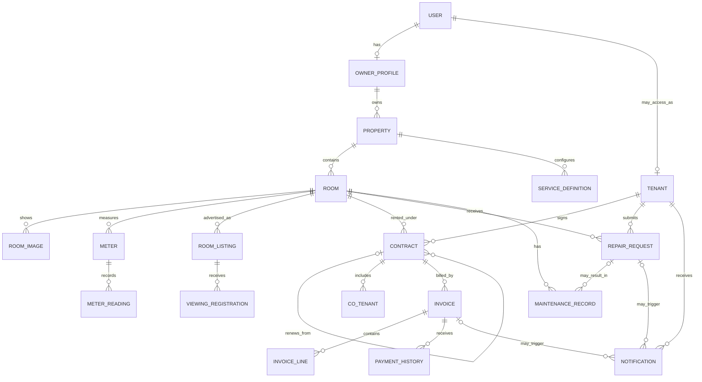

# RentEase Target Data Model

This document records the approved architecture direction and implementation plan before PostgreSQL. It complements `DATA_MODEL_ALIGNMENT.md`: alignment describes current truth; this file describes the target and safe path toward it.

No model, migration, settings, authentication, billing, database, or legacy change is authorized merely by this document. Each implementation stage remains approval-gated.

## Decision

Use the current Django project as the base. Do not rebuild the database from the supplied draw.io file.

Preserve:

- the Django `AbstractUser` authentication and permission model
- separate owner and tenant profiles
- owner/tenant scoped querysets
- listing-based viewing registrations
- contracts, invoice headers, payment history, repair requests, and maintenance records
- Django migrations as the executable schema source

Add or refine before real production data:

1. a property/building layer between owner and room
2. flexible invoice lines and meter-reading history
3. correct scheduled/in-progress/completed maintenance dates
4. production data-governance and protected-media boundaries
5. an explicit decision about legacy HOSTELLO tables in the production database

## Target Relationships

## Target Entities

### Property Foundation

`Property` is required before PostgreSQL real-data onboarding.

Minimum fields:

- owner profile
- stable property code and display name
- structured address text, ward, province/city, and optional coordinates
- contact phone and operating status
- timezone and optional house rules
- created and updated timestamps

`Room` should ultimately belong to `Property`. Owner access is derived through `room.property.owner`.

Migration must be transitional:

1. create `Property`
2. add nullable `Room.property`
3. backfill one property per existing owner in the disposable local database
4. update querysets, forms, admin, reports, listings, tests, and privacy checks
5. make `Room.property` required and change room-code uniqueness to property plus room code
6. remove the duplicate direct `Room.owner` only in a later reviewed migration

Keeping `Room.owner` temporarily avoids an unsafe all-at-once permission rewrite.

### Billing and Utilities

Keep `Invoice` as the financial header and `PaymentHistory` as immutable payment events.

Add:

- `ServiceDefinition`: property-scoped recurring or usage-based charge definition
- `Meter`: room meter with type, unit, serial/reference, and active state
- `MeterReading`: meter, period/date, value, captured-by user, and optional protected evidence
- `InvoiceLine`: invoice, type, description snapshot, quantity, unit, unit price, amount, and optional source reference

Required line types initially:

- rent
- electricity
- water
- service
- adjustment
- discount

Compatibility path:

1. add the new tables without removing `PriceConfig` or `InvoiceDetail`
2. add tests for line totals, meter monotonicity, uniqueness, and overpayment
3. backfill current invoice-detail values into invoice lines
4. switch invoice calculation and presentation to lines
5. retain `InvoiceDetail` as read-only compatibility data for one release
6. retire old detail/rate structures only after total-by-total reconciliation

Do not expose a RentEase internal invoice as a legal tax e-invoice. Tax e-invoice integration is a later boundary.

### Maintenance Lifecycle

Keep `RepairRequest` separate from `MaintenanceRecord`.

Refine maintenance with:

- `scheduled_for`
- nullable `started_at`
- nullable `completed_at`
- optional vendor and performed-by information
- estimated and actual cost when needed
- protected before/after document references

`performed_date` must not remain mandatory for a scheduled but unperformed job. Status/date constraints must prevent completed work without a completion time and prevent completion before start.

### Data Governance

Before any real citizen identity files or contracts are loaded into production:

- use private media storage with authorization checks
- record document category, owner, subject, retention status, and storage key
- record sensitive admin view/change audit events
- define consent/purpose and deletion/retention procedures
- prohibit identity media from public URLs, logs, exports, fixtures, and source control

The first implementation may use a small `PrivateDocument` metadata model and `AuditEvent` model. Storage provider selection belongs to deployment planning, not the database migration itself.

### Deferred Architecture

These remain later upgrades, not pre-PostgreSQL blockers:

- multi-user property membership and granular staff roles
- online payment gateway callbacks and reconciliation
- email, SMS, or Zalo delivery providers
- tax e-invoice integration
- listing-channel syndication
- mobile API/application
- subscription plans and commercial tenanting
- advanced analytics and forecasting

## Implementation Sequence

### Phase 14C-1 - Target Architecture Planning

Status: complete when this plan is reviewed.

- align draw.io with current Django relationships
- approve current-project-first architecture
- define required pre-PostgreSQL entities and deferred features
- define stage gates, tests, rollback, and real-data boundary

### Phase 14C-2 - Schema Safety Baseline and Legacy Audit

Status: complete. No schema change was made.

- the suite now protects owner/tenant isolation, billing snapshots and totals, overpayment, database uniqueness, role login, public listings, and repair/notification relationships
- active migrations have no dependency on legacy apps; legacy migrations depend on `accounts`
- current settings, root URLs, admin registrations, content types, permissions, and tables still include legacy apps
- production PostgreSQL should exclude legacy through Phase 14C-3D rather than silently retaining those tables

Expected files: test modules, current legacy-boundary reference, target-model reference, and roadmap only.

### Phase 14C-3A - Property Foundation

Status: in progress through separately reviewed additive subphases.

#### Phase 14C-3A1 - Additive Property Schema

Status: complete.

- added `Property` with owner-scoped code, name, structured location fields, optional coordinates, contact, status, timezone, house rules, and timestamps
- allowed address and province/city to remain blank during transition so backfill never invents location data
- added nullable `Room.property` while retaining `Room.owner` and its existing uniqueness/scoping behavior
- added model, uniqueness, transition, and forward/backward migration tests
- did not backfill data or change admin, forms, querysets, templates, reports, seed data, authentication, billing, or legacy behavior

#### Phase 14C-3A2 - Default Property Backfill

Status: complete through a reviewed reversible data migration.

- create one deterministic default Property per existing owner profile
- copy `UserProfile.rental_address` when present and leave unknown structured location fields blank
- link every existing Room to its owner's default Property
- keep `Room.owner` authoritative and `Room.property` nullable at the schema level
- verify row counts, owner/property consistency, uniqueness, and backward preservation without using real production data
- stop on reserved-code collision or an owner/property mismatch rather than silently guessing
- preserve any pre-existing Property relationship while reversing only migration-created defaults

#### Phase 14C-3A3 - Product Integration

Status: owner/admin slice complete; public/report/seed slice remains approval-gated.

- completed first slice: owner-scoped Property admin/portal management and room-form restriction to the authenticated owner's Properties
- next second slice: update listings, reports, public-safe presentation, and disposable seed data
- reject selecting a Property owned by another owner
- keep compatibility reads through `Room.owner` until all paths are verified

#### Phase 14C-3A4 - Required Relationship and Constraint

- require `Room.property` only after zero-null and owner-match checks pass
- move room-code uniqueness from owner plus room code to Property plus room code
- retain `Room.owner` until a later reviewed cleanup after PostgreSQL cutover

Expected files across the remaining subphases:

- `backend/properties/models.py`, `backend/properties/admin.py`, and new reviewed `backend/properties/migrations/` files
- `backend/portal/views.py`, `backend/portal/forms.py`, and `backend/portal/tests.py`
- `backend/listings/views.py`, `backend/listings/forms.py`, `backend/listings/tests.py`, and listing templates only where property context is visible
- `backend/reports/views.py`, `backend/reports/services.py`, and affected report templates
- affected owner room/listing templates under `frontend/templates/portal/`
- `backend/portal/management/commands/seed_rentease_demo_data.py` for disposable development data only
- current architecture/state/next-action documentation

Resolved decisions: keep `Room.owner` during transition, create one default Property per owner profile, avoid invented address data, and defer Property-scoped room-code uniqueness until after backfill and product integration.

Disposable-data acceptance checks for the transitional migration:

- record pre-migration counts for owner profiles, rooms, contracts, listings, invoices, repairs, and distinct room owners
- preserve every recorded business-row count after the migration
- create exactly one default Property per owner profile under the approved backfill rule
- require zero rooms with a null Property after backfill
- require zero rooms where `room.owner_id != room.property.owner_id`
- require zero duplicate `(property_id, room_code)` pairs before adding that uniqueness constraint
- after reverse migration, preserve the original room count and every original `Room.owner_id`

### Phase 14C-3B - Billing and Meter Foundation

- implement service, meter, reading, and invoice-line models
- add calculation and reconciliation tests before switching reads/writes
- backfill and reconcile existing disposable SQLite invoice totals
- keep payment and overpayment rules unchanged

Likely source areas: `billing`, `portal`, `reports`, admin, templates, tests, and migrations.

### Phase 14C-3C - Maintenance and Data Governance

- correct maintenance schedule/completion semantics
- add protected-document metadata and sensitive access auditing
- preserve tenant/room relationship validation
- verify no identity path is exposed publicly

Likely source areas: `maintenance`, `tenants`, admin, portal, media access, tests, and migrations.

### Phase 14C-3D - Production Legacy Exclusion

- create a production-safe installed-app boundary that excludes `students`, `attendance`, `requests`, `fees`, and `notices`
- remove production URL and admin startup dependencies on those apps without deleting their source or local history
- verify legacy content types, permissions, and tables are absent from a clean production migration
- keep local compatibility behavior explicit rather than conditionally hiding errors

Likely source areas: settings, root URLs, legacy admin loading, production checks, tests, and current architecture documentation. This phase requires its own approval because it changes settings and legacy runtime behavior.

### Phase 14C-4 - Fresh PostgreSQL Provisioning

- provision credentials outside Git
- create an empty PostgreSQL database
- run reviewed Django migrations from zero
- verify only approved application schemas are present
- bootstrap the first administrator safely
- run checks and the complete test suite against PostgreSQL
- retain SQLite only as an explicit local-development fallback

No demo seed command may run against the production database.

### Phase 14C-5 - Real-Data Onboarding

- accept only owner-approved source files or controlled admin entry
- validate and stage imports before committing them
- import in dependency order: owners, properties, rooms, tenants, contracts, rates/services, invoices, payments, maintenance, listings
- reject duplicate identities, room codes, contracts, invoice periods, and transaction references
- reconcile counts and financial totals with the owner
- record import provenance without committing source data or exports

## Verification Matrix

Every implementation stage must include:

- `manage.py check`
- `manage.py makemigrations --check --dry-run`
- complete targeted tests and full test suite
- `git diff --check`
- migration forward and backward on a disposable database where reversible
- correct-role success and wrong-role rejection
- cross-owner and cross-tenant identifier isolation tests
- invoice total, remaining balance, and overpayment tests
- no public citizen-ID or protected-document URL
- desktop/mobile verification when templates change

PostgreSQL provisioning additionally requires:

- clean migration from zero
- expected table, constraint, and index inventory
- `DEBUG=False` system check
- backup/restore rehearsal
- fresh administrator login
- no demo/regression records

## Rollback Strategy

- create a SQLite backup only through an approved, local, non-committed procedure
- use additive migrations before destructive migrations
- keep compatibility fields until new calculations and reads are reconciled
- never combine property, billing, maintenance, legacy removal, and PostgreSQL cutover in one migration or commit
- stop the cutover and recreate the empty PostgreSQL database if schema verification fails before real data is loaded
- after real data exists, rollback requires a tested database backup and restore procedure, not reverse migrations alone

## Stop Conditions

Stop and request a new approval if:

- owner/tenant scoping would change unexpectedly
- an active migration depends on a legacy app planned for exclusion
- billing totals differ during backfill
- an irreversible migration is proposed without a verified backup
- real data arrives without an identified owner, purpose, or approved source
- protected identity media would be served by a public URL
- PostgreSQL migration creates unexpected legacy or third-party tables
- the current worktree or Django checks are not clean

## Approval Boundary

The owner/admin slice of Phase 14C-3A3 is complete. The next implementation task is its separately approval-gated public listing/report/seed-data slice. Phase 14C-3D must be completed before Phase 14C-4 provisions the clean PostgreSQL database.
